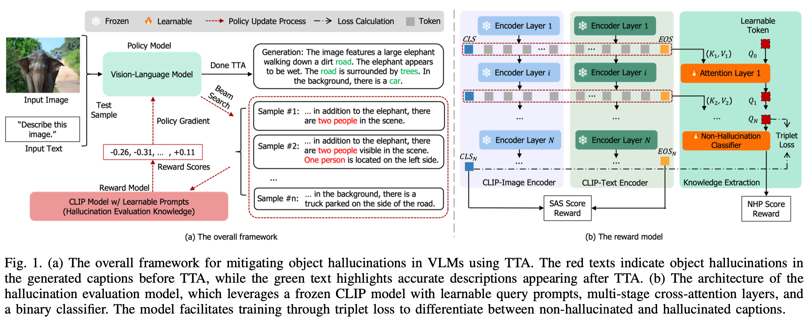
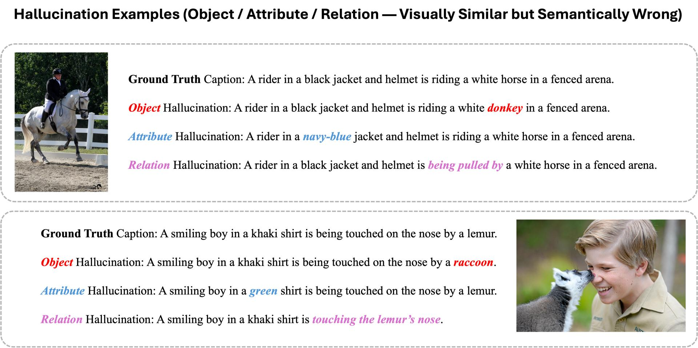

# VisionGuard

### *RL-based Agentic Self-Correction and Hallucination Mitigation for Vision-Language Models*

VisionGuard is an inference-time framework for Vision-Language Models (VLMs). It treats VQA/Captioning generation as a closed-loop agentic process: a **Generator** proposes candidates, a **Critic** scores factual consistency and visual alignment, and a **Self-Correction** module iteratively refines the VLM policy via reinforcement learning. Conceptually, our RL formulation, sampling a group of candidates and updating the policy with relative rewards, is similiar to [Group Relative Policy Optimization (GRPO)](https://arxiv.org/abs/2402.03300), though our VisionGuard was **proposed and tested roughly 10 months earlier than GRPO**.

---

## Overview

Vision-Language Models often produce captions that describe objects, attributes, or relations not present in the image. VisionGuard mitigates these hallucinations at **test time** through a lightweight, RL-driven self-correction loop that adapts only a tiny fraction of VLM parameters per sample, improving factual grounding.



---

## Agentic Architecture

VisionGuard decomposes inference into three cooperating roles:

| Role | Component | Responsibility |
|------|-----------|------------------|
| **Generator** | VLM (LLaVA / InstructBLIP) | Produces multiple caption candidates via beam search |
| **Critic** | VisionGuard Reward Model (Customized CLIP) | Scores each candidate on semantic alignment and non-hallucination likelihood |
| **Self-Corrector** | RL Policy Optimizer | Applies policy-gradient updates to LayerNorm parameters, then re-generates |

```
Image + Prompt
     │
     ▼
┌─────────────┐     beam candidates     ┌──────────────────┐
│  Generator  │ ──────────────────────► │     Critic       │
│  (VLM)      │                         │  SAS + NHP score │
└─────────────┘                         └────────┬─────────┘
     ▲                                           │
     │         policy-gradient update            │
     └──────── Self-Corrector (RL-TTA)  ◄────────┘
                    (repeat K steps)
     │
     ▼
  Corrected Caption
```

### Dual Reward Signal

The Critic combines two complementary signals:

- **SAS (Semantic Alignment Score):** CLIP-based image–text alignment.
- **NHP (Non-Hallucination Probability):** Binary hallucination classifier trained with triplet loss on our large-scale synthetic dataset.

We construct a large-scale synthetic dataset from real image–caption pairs. For each sample, a ground-truth caption is paired with controlled hallucinated variants across three error types: **object** (e.g., *horse* → *donkey*), **attribute** (e.g., *black* → *navy-blue*), and **relation** (e.g., *riding* → *being pulled by*). These visually similar but semantically wrong captions provide hard negatives for triplet-loss training, teaching the Critic to distinguish factual grounding from subtle hallucinations.


*Example from our synthetic dataset: ground-truth captions (black) vs. object / attribute / relation hallucinations (red / blue / pink).*

### Why "Agentic Self-Correction"?

Unlike one-shot decoding, VisionGuard runs a **multi-step perceive → generate → evaluate → correct** loop at inference time. Each step:
1. Generates candidate actions (captions).
2. Receives structured feedback from the Critic.
3. Updates the policy (LayerNorm γ, ~0.003% of parameters).
4. Repeats until convergence or a fixed step budget.

Parameters are **reset per image** (episodic adaptation), so correction is sample-specific and leaves no permanent drift in the base VLM.

---

## Key Features

- **RL-based self-correction** — Policy-gradient test-time adaptation (TTA) with dual rewards.
- **Agentic closed loop** — Generator, Critic, and Self-Corrector roles at inference.
- **Hallucination mitigation** — Reduces CHAIR by **15.4%** (LLaVA-7B) and **17.3%** (InstructBLIP).
- **Lightweight** — Updates only LayerNorm γ in the language backbone.
- **Post-hoc / plug-and-play** — No full-model retraining; works with off-the-shelf VLMs.
- **Custom CLIP Critic** — Learnable query tokens + cross-attention for hallucination scoring.

---

## Repository Structure

```
VisionGuard/
├── visionguard/            # Shared Python package
│   └── critic/
│       └── custom_clip.py  # VisionGuard Critic (CustomCLIPModel)
├── AMBER/                  # Benchmark evaluation (CHAIR, Cover, Hal, QA metrics)
├── model/
│   ├── blip/               # VisionGuard pipeline for InstructBLIP
│   │   └── TTA_instructBlip.ipynb
│   └── llava/              # VisionGuard pipeline for LLaVA
│       └── TTA_LLaVA.ipynb
├── image/                  # Framework diagram and figures
└── temp/                   # Environment and dataset smoke tests
```

---

## Quick Start

### 1. Environment

```bash
conda env create -f environment.yml
conda activate transformers
```

For AMBER evaluation, also install:

```bash
pip install nltk spacy
python -m spacy download en_core_web_lg
```

### 2. Data & Checkpoints

| Resource | Purpose |
|----------|---------|
| [AMBER](https://github.com/junyangwang0410/AMBER) | Evaluation benchmark (1,004 images) |
| `clipmodel.pth` | Pre-trained VisionGuard Critic weights (not included in this repo; **please contact the authors to obtain the weights**, then place under project root or update the path in notebooks) |
| PixelProse subset | Used to train the Critic (training script coming soon) |

### 3. Run Self-Correction

Open and run the notebook for your target VLM:

- **LLaVA-1.5-7B:** `model/llava/TTA_LLaVA.ipynb`
- **InstructBLIP-Vicuna-7B:** `model/blip/TTA_instructBlip.ipynb`

Default hyperparameters: `num_steps=5`, `num_beams=5`, `max_new_tokens=512`.

### 4. Evaluate on AMBER

```bash
python AMBER/inference.py \
  --inference_data path/to/visionguard_results.json \
  --evaluation_type g
```

---

## Supported Models

| Model | HuggingFace ID | Status |
|-------|----------------|--------|
| LLaVA-1.5-7B | `llava-hf/llava-1.5-7b-hf` | Supported |
| InstructBLIP-Vicuna-7B | `Salesforce/instructblip-vicuna-7b` | Supported |

---

## Citation

If you use VisionGuard in your research, please cite:

```bibtex
@inproceedings{zhao2025visionguard,
  title={Mitigating Image Captioning Hallucinations in Vision-Language Models: A Post-Hoc Test-Time Adaptation Approach with Reinforcement Learning},
  author={Zhao, Fei and others},
  booktitle={IEEE International Conference on Multimedia and Expo (ICME)},
  year={2025}
}
```

---

## Roadmap

- [ ] Extract notebooks into an installable `visionguard` Python package
- [ ] Add YAML configs and CLI entry points
- [ ] Release Critic training code (PixelProse triplet loss)
- [ ] Explicit verbal self-correction prompts (generate → critique → revise)
- [ ] Extend to VQA, grounding, and newer VLMs (LLaVA-NeXT, Qwen-VL, Llama 3.2 Vision)

---

## Acknowledgments

1. The [AMBER](https://github.com/junyangwang0410/AMBER) authors for evaluation benchmarks.
2. NVIDIA for GPU resources supporting efficient experimentation.
